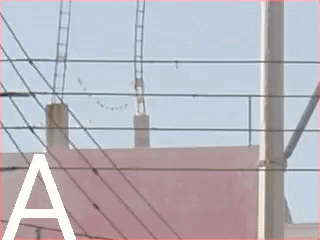

# bitmap2video


Generate video from a Bitmap, Canvas, or resource drawable in Android.

Create mp4 video from Bitmaps or anything you can draw to a hardware accelerated Canvas.  Pure, simple Android MediaCodec implementation.  Requires no third party libs or NDK.

Currently supports the MP4 container and both AVC/H264 and HEVC/H265. Easily extensible to other
 supported formats.  

Run the sample app or check out
and [MainActivity](app/src/main/java/com/homesoft/bitmap2video/MainActivity.java)
for an example.

# Dependencies
Add it in your root build.gradle at the end of repositories:

    allprojects {
      repositories {
        ...
        maven { url 'https://jitpack.io' }
      }
  	}
  
  Add to your app dependencies:

    dependencies {
      implementation 'com.github.israel-fl:bitmap2video:2.0.0'
    }


# Initialize library
Simply create a `Muxer` object

```kotlin
val muxer = Muxer(this@MainActivity, "/files/video.mp4")
// and mux
muxer.mux(imageArray)
```

Use callbacks to listen for video completion:
```kotlin
muxer.setOnMuxingCompletedListener(object : MuxingCompletionListener {
    override fun onVideoSuccessful(file: File) {
        Log.d(TAG, "Video muxed - file path: ${file.absolutePath}")
    }

    override fun onVideoError(error: Throwable) {
        Log.e(TAG, "There was an error muxing the video")
    }
})

Thread(Runnable {
    muxer.mux(imageArray, R.raw.bensound_happyrock)
}).start()
```

Or use a co-routine by calling `muxAsync`:

```kotlin
scope.launch {
    when (val result = muxer.muxAsync(imageArray, R.raw.bensound_happyrock)) {
        is MuxingSuccess -> {
            Log.i(TAG, "Video muxed - file path: ${result.file.absolutePath}")
            onMuxerCompleted()
        }
        is MuxingError -> {
            Log.e(TAG, "There was an error muxing the video")
            bt_make.isEnabled = true
        }
    }
}
```

### Passing a custom configuration object 
```kotlin
val muxerConfig = MuxerConfig(this, 600, 600, 'video/avc', 3, 1F, 1500000)
val muxer = Muxer(this@MainActivity, muxerConfig!!)
// or
muxer.setMuxerConfig(muxerConfig)
```

#### Supported configuration
- File object
- video width
- video height
- Mimetype
- Frames per image (how many seconds to display each image)
- Frames per second
- Bitrate
- FrameMuxer (only MP4 included currently)
- IFrame Interval

### Acceptable media types:
The library currently supports `Bitmap`, `Canvas`, and drawable resources (`R.drawable.image1`)

### Adding Audio
In order to add audio, pass in an audio track to the `mux` method.
```kotlin
muxer.mux(imageArray, R.raw.bensound_happyrock)
```

### Convenience utility functions
We provide a few functions to simplify a couple of tasks. These can be
found as static methods under `FileUtils`

##### Get an `AssetFileDescriptor` from a raw resource
`getFileDescriptor(Context context, int R.raw.sound_file)`

##### Get a `File` object for your video
`getVideoFile(final Context context, final String fileName)`

##### Export the created file to other applications
`shareVideo(Context context, File file, String mimeType)`

##### Note
These utility functions use the library's `ContentProvider` with
declared authorities and specified paths.

#### Declare your own ContentProvider
You can change which provider is being used and specify your paths if
you register your own against the manifest and create your own
resources. You must then pass in the appropriate paths to the functions.
See the library's
[AndroidManifest](app/src/main/java/com/homesoft/bitmap2video/library/src/main/AndroidManifest.xml)
for an example.

```java
getVideoFile(Context context, String fileDir, String fileName)
```
and
```java
shareVideo(Context context, File file, String mimeType, String fileAuthority)
```
